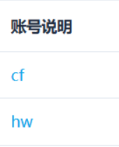
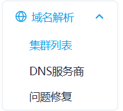
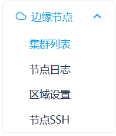
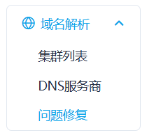
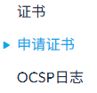
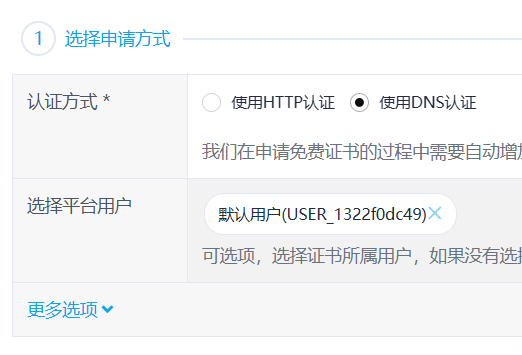
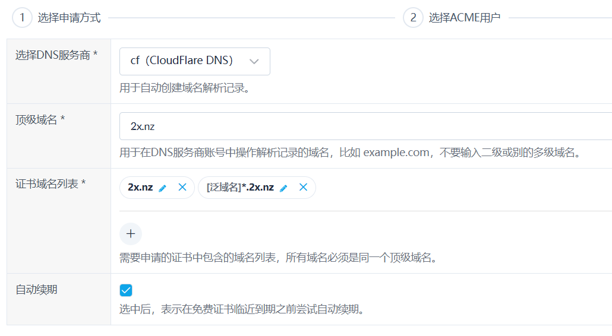

# 安装GoEdge

> [使用脚本快速安装GoEdge管理系统 - 文档 - GoEdge CDN | 自建CDN](https://goedge.cloud/docs/Admin/install-script.md)

一行脚本安装

```bash
curl -s https://goedge.cloud/install.sh | bash
```

# 卸载GoEdge

查看监听端口为 **7788** 的程序PID

```bash
root@AcoFork-NAS:~/oci# apt install lsof && lsof -i :7788
Reading package lists... Done
Building dependency tree... Done
Reading state information... Done
lsof is already the newest version (4.95.0-1).
0 upgraded, 0 newly installed, 0 to remove and 254 not upgraded.
COMMAND       PID USER   FD   TYPE  DEVICE SIZE/OFF NODE NAME
edge-admi 1733510 root    7u  IPv6 8663743      0t0  TCP *:7788 (LISTEN)
edge-admi 1733510 root    9u  IPv6 8746827      0t0  TCP 10.147.17.1:7788->10.147.17.147:39580 (ESTABLISHED)
edge-admi 1733510 root   10u  IPv6 8828980      0t0  TCP 10.147.17.1:7788->10.147.17.147:45730 (ESTABLISHED)
root@AcoFork-NAS:~/oci#
```

用PID找程序路径

```bash
root@AcoFork-NAS:~/oci# readlink -f /proc/1733510/exe
/usr/local/goedge/edge-admin/bin/edge-admin
root@AcoFork-NAS:~/oci#
```

这样你就成功找到了 **EdgeAdmin安装目录** ： `/usr/local/goedge/edge-admin/` 

接着前往 [卸载管理平台 - 文档 - GoEdge CDN | 自建CDN](https://goedge.cloud/docs/Admin/Uninstall.md) 按照教程一步步卸载即可

# API节点的配置

安装阶段会让你配置API节点，会让你配置端口和公网

你需要保证端口未占用，默认端口 **8001** （已知飞牛OS会占用）。如果占用了就换一个

你需要保证 **公网** 可以被你之后添加的节点 **主动访问** 到（我的做法是使用IPv6公网，并保证之后添加的节点都有IPv6地址）

# 添加DNS服务商

首先前往


添加你的DNS账号。**hw** 用来做CDN域名的自治解析，**cf** 用来后续签发SSL



点进去，确保能获取到域名


# 设置CDN域名

前往



设置好DNS子域名


# 添加节点

前往




然后填写节点IP+SSH认证方式（密码/密钥），之后goedge会主动通过SSH连接节点安装服务

# 配置节点的DNS IP

前往



会让你填写每个节点的DNS IP，填写节点的 **公网IP** 即可

# 签发SSL

前往







随便写个邮箱


写域名（支持泛域名）



稍等片刻就签发成功


# 禁止未绑定域名访问/禁止IP直接访问

字面意思，如图设置


# 创建网站

前往


接下来你们自己研究吧 我要睡了
