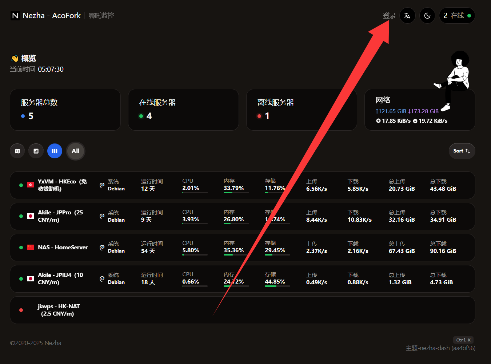
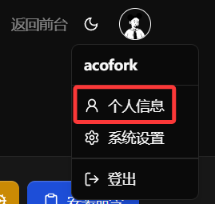
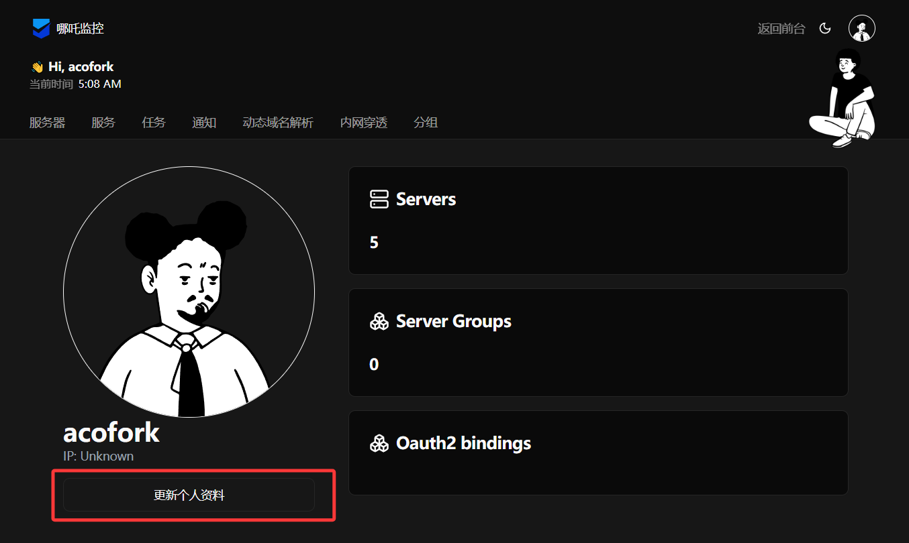
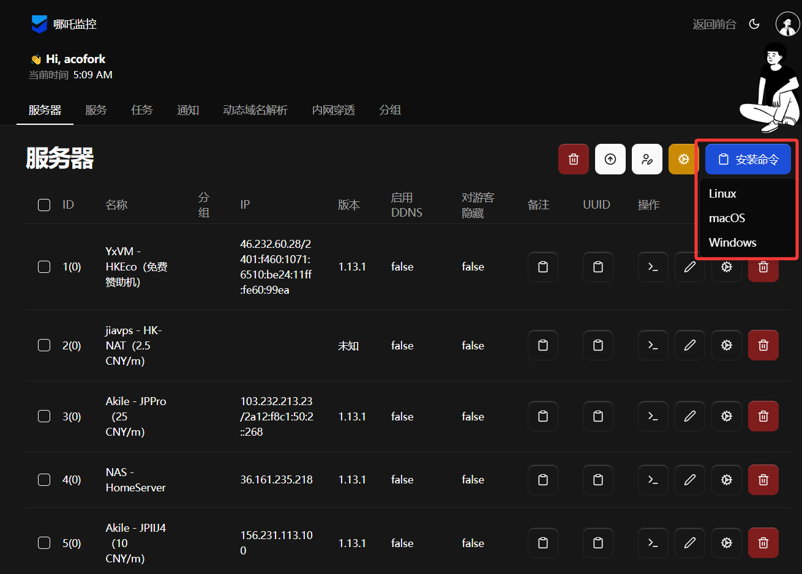

> 官方教程： https://nezha.wiki/

# 安装面板端（Dashboard）

> 面板端即WebUI，同时也接受后端连接。用户和面板连接使用WebSocket，后端和面板端使用gRPC通信

```bash
curl -L https://raw.githubusercontent.com/nezhahq/scripts/refs/heads/main/install.sh -o nezha.sh && chmod +x nezha.sh && sudo ./nezha.sh
```

默认端口为 8008

在 `请指定安装命令中预设的 nezha-agent 连接地址 （例如 example.com:443）` 填写你的 `VPS IP:8008` 。当然，你也可以套CDN，如果套CDN则填写 `CDN域名:443` ，请确保你的CDN支持gRPC通信。本人不推荐后端和面板通信使用CDN

```bash
请输入站点标题: Nezha - AcoFork
请输入暴露端口: (默认 8008)
请指定安装命令中预设的 nezha-agent 连接地址 （例如 example.com:443）46.232.60.28:8008
是否希望通过 TLS 连接 Agent？（影响安装命令）[y/N]n
请指定后台语言
1. 中文（简体）
2. 中文（台灣）
3. English
请输入选项 [1-3]1
```

接下来，你应该可以在 8008 端口进入哪吒探针的WebUI

点击登录，默认账密均为 `admin` 



首先我们先更改管理员账密，鼠标移到右上角头像，点击 `个人信息` 



然后点击 `更新个人资料` 更改管理员账密



# 安装后端（Agent）

打开哪吒探针的WebUI，在服务器一栏可以找到安装命令，选择对应系统的，然后前往终端执行即可。稍后你将会看到一个随机名称的新服务器上线

*如果你的服务器在中国大陆，可能无法连接上 `raw.githubusercontent.com`  。推荐使用镜像 `raw.gitmirror.com` 即可*



# 配置服务

哪吒探针也支持类似UptimeKuma那种的服务监测，支持HTTP Ping TCP，具体参见导航栏的服务

*这里添加的所有服务，都可以借用已添加到哪吒探针的服务器进行监测*


# 配置通知

哪吒探针支持配置通知，以在服务宕机等情况及时通知你，详见 [通知设置 | 哪吒服务器监控](https://nezha.wiki/guide/notifications.html)

# 疑难解答

- 我套了CDN，服务器可以成功上线，但是获取到的IP为内网IP：请在系统设置中配置真实IP请求头

- 我使用Cloudflare CDN，服务器始终无法上线。原因不明，但是可以通过部署该项目解决 [yumusb/nezha-new](https://github.com/yumusb/nezha-new)
