# 区域选择

注册的时候会让你选择一个账户主区域，选择后 **不可更改** ，我选择的是 **Japan East (Tokyo)** 。由于甲骨文的arm免费机是需要抢的，你选择的区域越热门，能抢到arm机子的概率就越低

# 安全性

> https://cloud.oracle.com/identity/domains/my-profile/security

建议启用 **两步验证** 使用你的移动设备下载一个甲骨文App 然后扫码即可（实际上就是一个联网的TOTP）


如果需要更改密码，它在这里

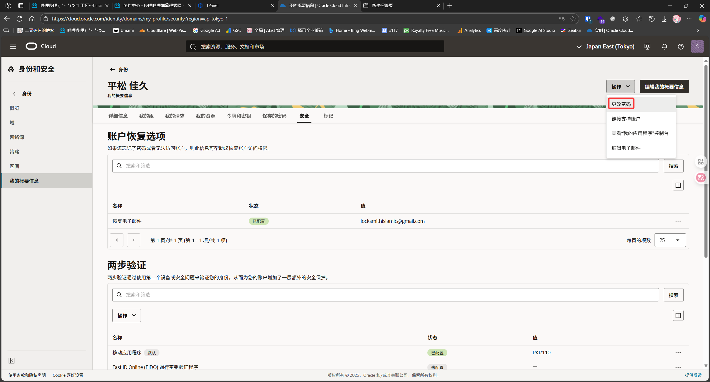

# 没有Debian系统？

如果你前往 https://cloud.oracle.com/compute/instances/create 尝试创建实例。会发现没有 **Debian** 映像 。我们可以通过最下面 **我的映像** 来上传自己的自定义映像，详细步骤往下看

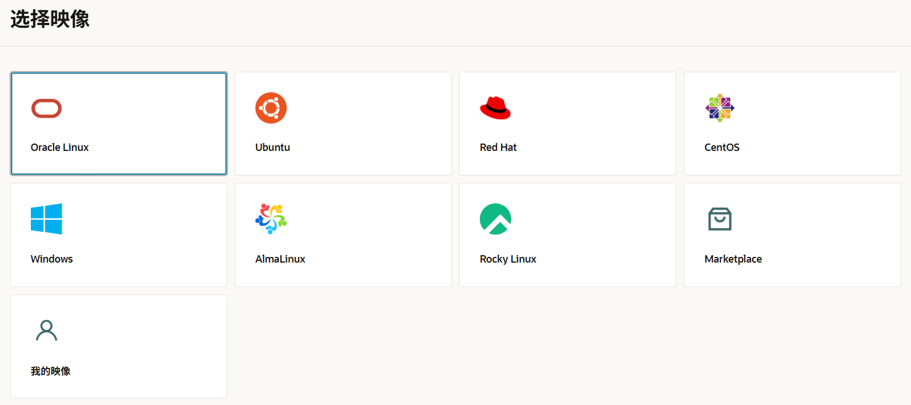

写在前面，如果你需要往甲骨文上传自定义映像，你需要先将自定义映像上传到你 **甲骨文账户下的对象存储** ，随便找一个对象存储上传是不行的！！！

首先下载适用于云的Debian映像，进入 [下载 Debian](https://www.debian.org/distrib) ，找到 **使用 Debian 云镜像** 分别下载 

- 64 位 AMD/Intel ([qcow2](https://cloud.debian.org/images/cloud/trixie/latest/debian-13-generic-amd64.qcow2 "用于 64 位 AMD/Intel 的 OpenStack 镜像，qcow2"), [raw](https://cloud.debian.org/images/cloud/trixie/latest/debian-13-generic-amd64.raw "用于 64 位 AMD/Intel 的 OpenStack 镜像，raw"))
- 64 位 ARM ([qcow2](https://cloud.debian.org/images/cloud/trixie/latest/debian-13-generic-arm64.qcow2 "用于 64 位 ARM 的 OpenStack 镜像，qcow2"), [raw](https://cloud.debian.org/images/cloud/trixie/latest/debian-13-generic-arm64.raw "用于 64 位 ARM 的 OpenStack 镜像，raw"))

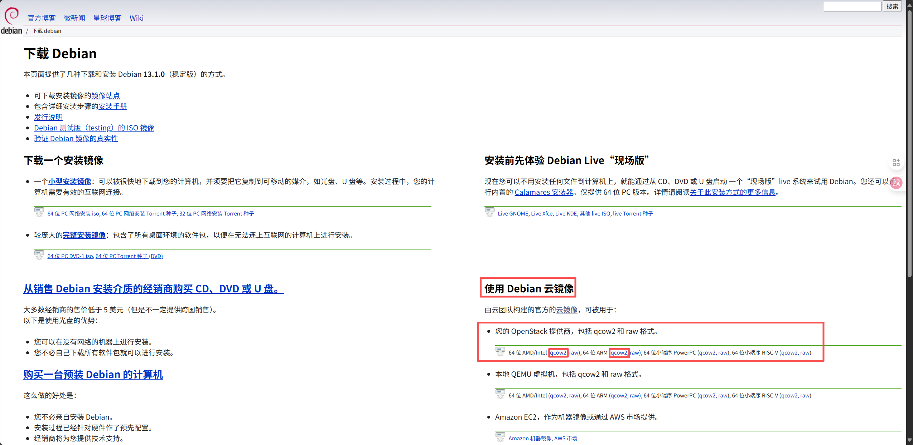

你会得到


前往 https://cloud.oracle.com/object-storage/buckets 创建一个新存储桶，点击编辑可见性，改为 **公共** 

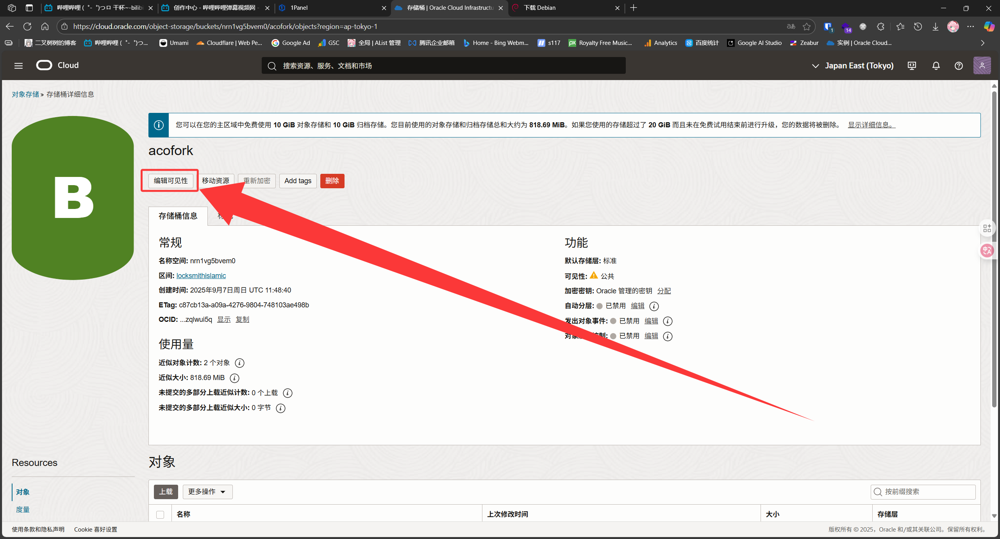

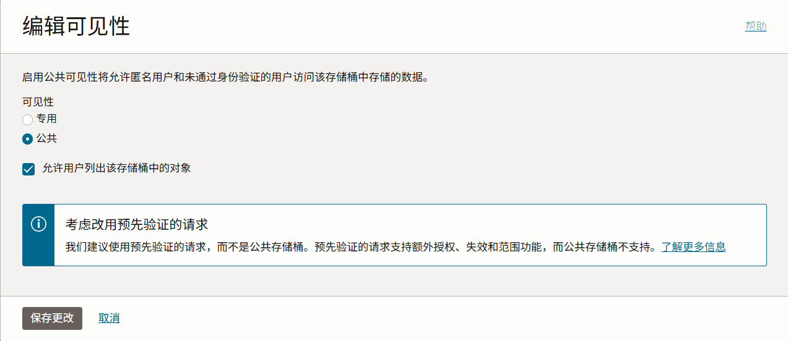

然后上载刚刚下载的映像

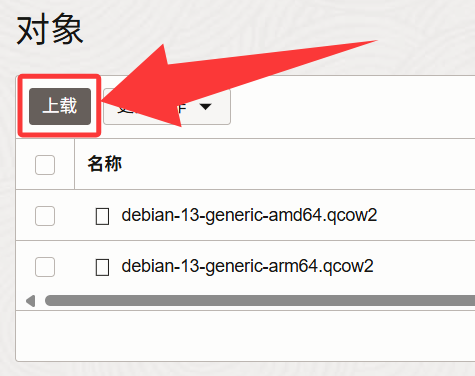

前往 https://cloud.oracle.com/compute/images 点击 **导入映像** 按需填写

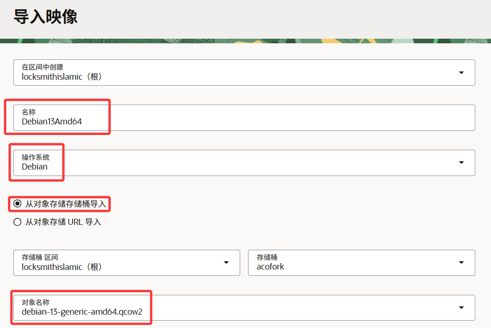

映像类型和启动模式如图填写（性能最大化）


验收无误后，点击右下角的 **导入映像** ，大约需要 **20min** ，状态将变为 **可用**


点击其中一个映像，进入详情页面，针对于 **arm映像** 我们需要手动调节 **兼容的配置**。右上角点击 **操作 - 编辑详细信息**


全部打勾，保存更改

*仍然需要注意，创建实例的时候请看准是x86还是arm实例，x86实例无法使用arm映像，反之亦然*


然后点击右上角**创建实例**，即可使用自定义映像创建实例


# 创建VCN（网络）

前往 https://cloud.oracle.com/networking/vcns 点击 **创建VCN** 改个名称然后一路下一步即可


成功创建一个如图的网络


# 为VCN附加IPv6前缀

前往 https://cloud.oracle.com/networking/vcns

进入我们刚刚创建的VCN


导航栏选择 **子网** - **公共子网**

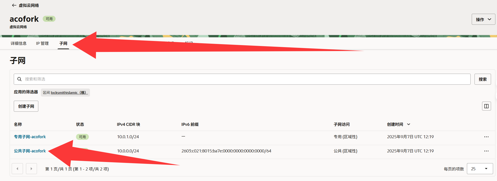

在新页面的导航栏点击 **IP管理**

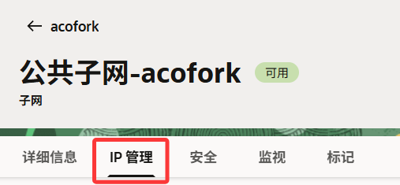

往下滚动，添加 **IPv6前缀**

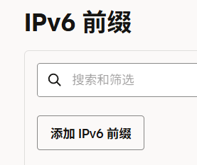

# 创建实例

前往 https://cloud.oracle.com/compute/instances 点击 **创建实例**

在这里可以更改映像为自定义映像，即我们刚刚上传的Debian映像

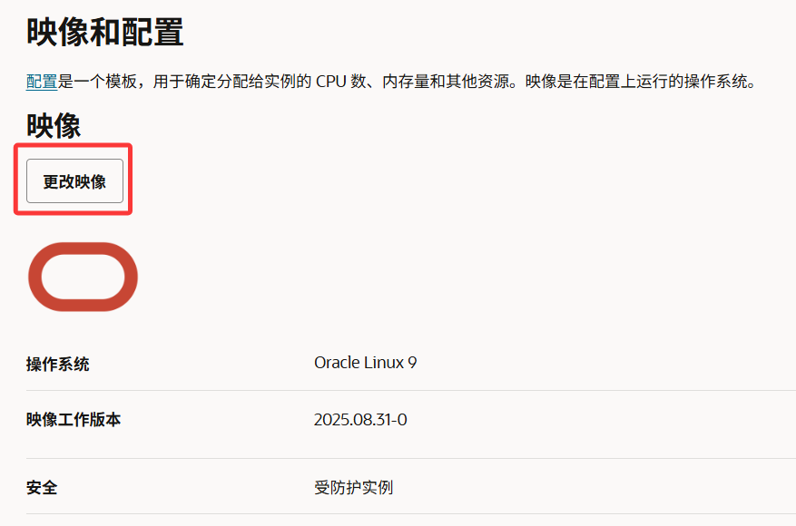

在这里可以更改 **架构和配置** 。永久免费套餐为

- VM.Standard.E2.1.Micro：**两个** 1c1g的x86 实例，**不可合并为2c2g使用**

- VM.Standard.A1.Flex：共 4c24g的arm64 实例，**可以随意拆分**

**重要事项**

**闲置计算实例的回收**

Oracle 可能会回收闲置的“永久免费”计算实例。如果在 **7 天周期内** 同时满足以下条件，则虚拟机和裸金属计算实例会被视为闲置：

- **CPU 使用率**（95 百分位数）低于 20%

- **网络使用率**低于 20%

- **内存使用率**低于 20%（仅适用于 A1 规格）

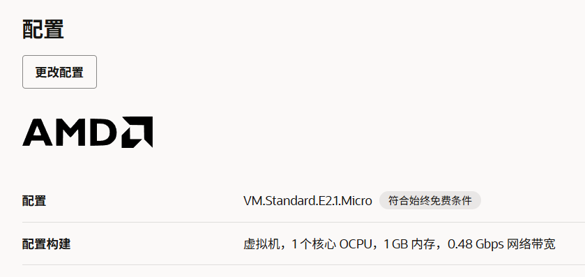

在这里可以选择是否附加 **IPv4** 和 **IPv6** 地址，其中， **IPv6** 地址的附加功能取决于是否在VCN附加了 **IPv6前缀**

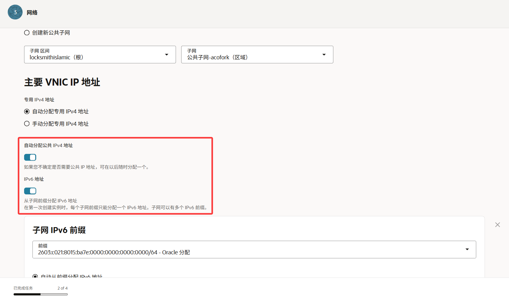

在这里可以更改IO配置，直接拉满即可

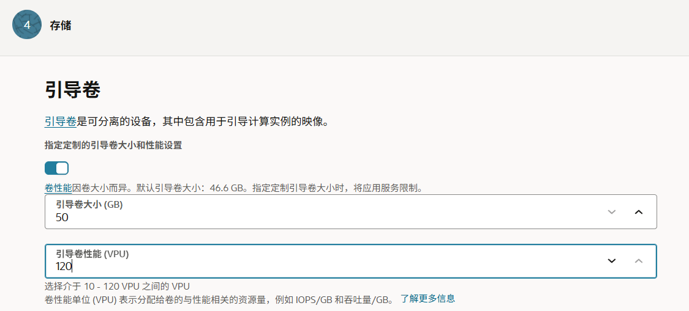

在这里可以更改SSH相关配置

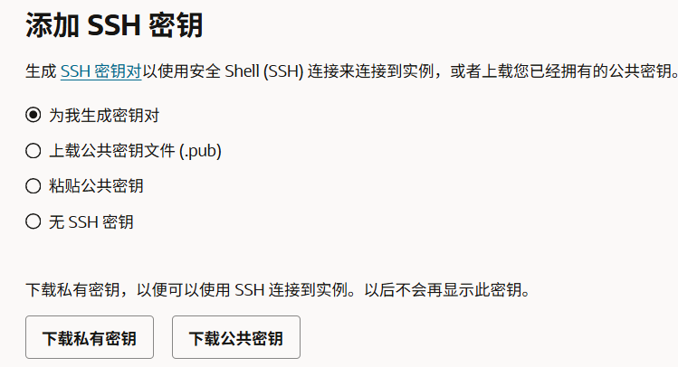

一路下一步，验收无误后点击 **创建**

# 更改防火墙

> 我直接改为全允许，我更喜欢在Linux服务器上配置 ufw 来实现防火墙

前往 https://cloud.oracle.com/networking/vcns ，进入你刚刚创建的VCN，导航栏点击 **安全** 找到这个


导航栏继续找到 **安全规则** 我直接全放行

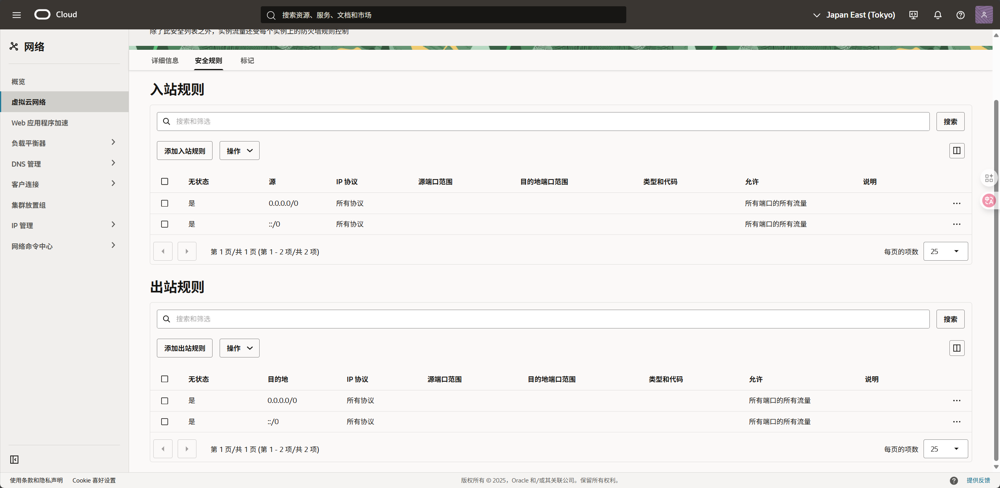

# 使用SSH连接实例

前往 https://cloud.oracle.com/compute/instances 可以看到 **公共IP** ，携带你的 **SSH私钥** 通过 **22 端口** 连接服务器即可


# 改root登录

如果你使用root直接登录，会提示

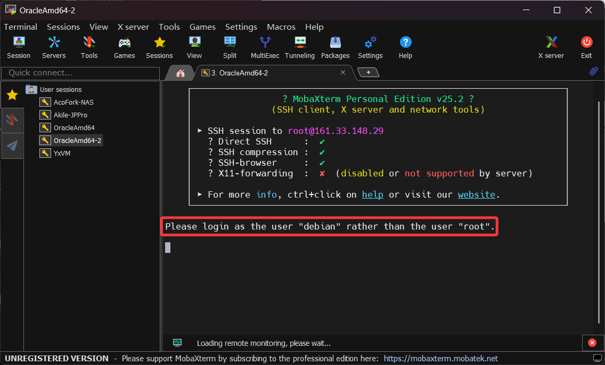

意为： **请使用名为 `debian` 的用户登录而不是 `root` 用户**

那我们就听他的，想把登录名改为 **debian**

再次尝试，成功登录了

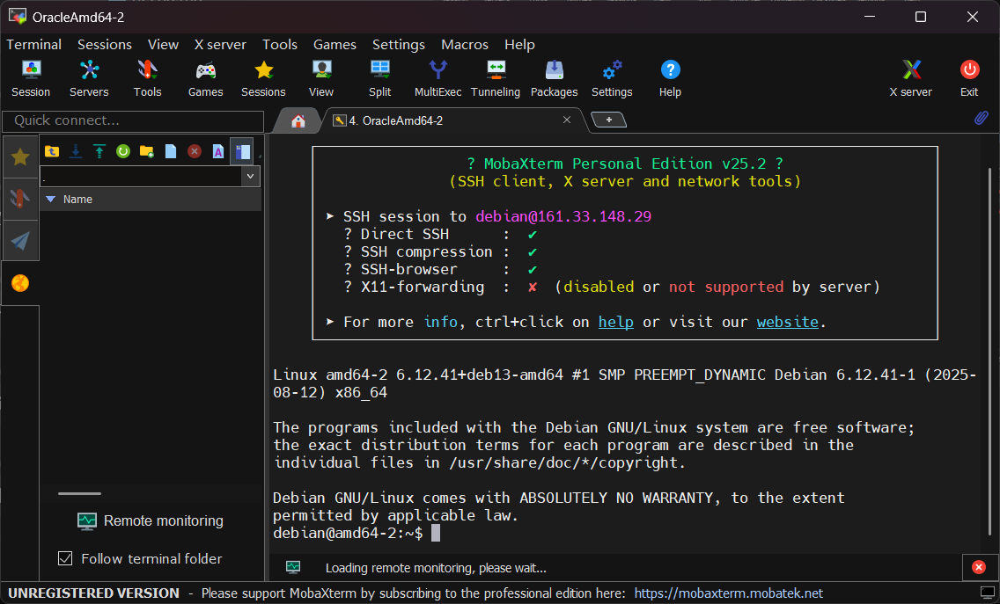

首先提权为 **root**

```bash
sudo -i
```

接着编辑root用户的ssh公钥文件，以允许直接使用root登录

```bash
nano /root/.ssh/authorized_keys
```

**Ctrl+K** 删除第一行的警告，并且重新写入你的SSH公钥

**Ctrl+X** 保存并退出，然后重启 **sshd** 

```bash
systemctl restart sshd
```

重新使用 **root** 登录，成功

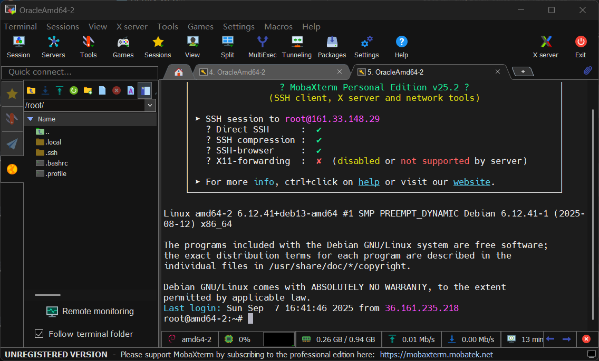

# 自动脚本抢arm机

如果你在创建实例的时候选择arm，并且最后创建的时候提示

**可用性域 VM.Standard.A1.Flex 中配置 AD-1 的容量不足。请在其他可用性域中创建实例，或稍后重试。如果指定了容错域，请尝试在不指定容错域的情况下创建实例。如果这样不起作用，请稍后重试。[了解有关主机容量的更多信息。](https://www.oracle.com/cloud/free/faq.html)**

字面意思，我们可以依靠一个自动脚本来无限重试

前往 https://cloud.oracle.com/identity/domains/my-profile/auth-tokens 点击 **添加API密钥** 并 **下载私有密钥（只能下一次）** ，然后会弹出 **配置文件预览** ，复制它，后面要用


克隆仓库 [chacuavip10/oci_auto](https://github.com/chacuavip10/oci_auto)

编辑 `config` 内的内容，将内容清空，粘贴上一步的 **配置文件预览** 的内容。但是确保最后一行为

```bash
key_file=oci_private_key.pem
```

前往 https://cloud.oracle.com/compute/instances/create 再次尝试创建一个arm机子，并且F12抓包，查看该包的详情

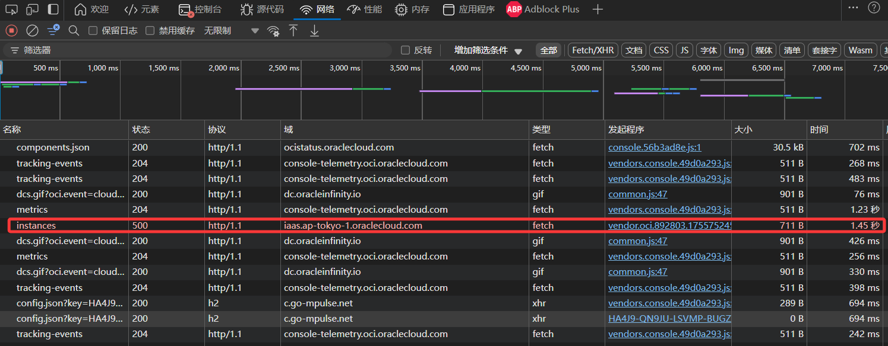

对号入座填写 `oci_auto.py` 内的内容


安装依赖

```bash
apt install python3
apt install pip
pip install oci requests
```

运行

```bash
python3 oci_auto.py
```

即可自动抢机子，可能几个月后，你的账户下就会多一台arm了（？


